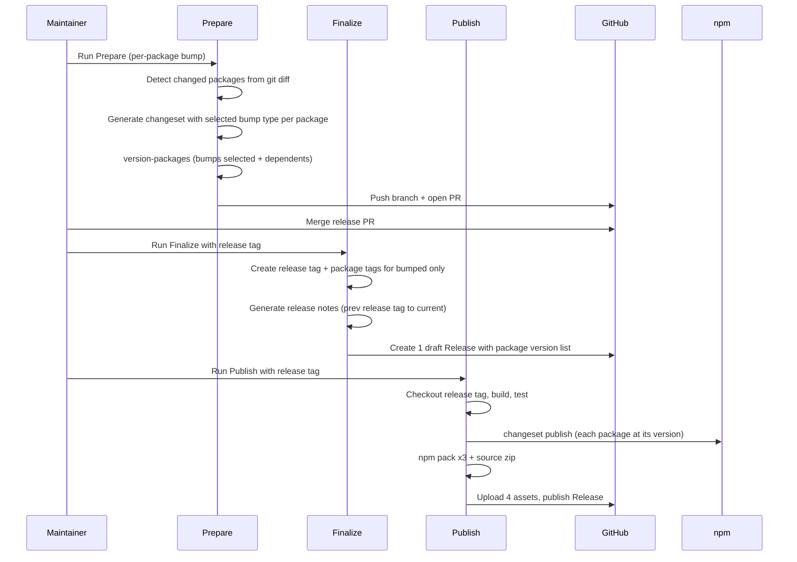
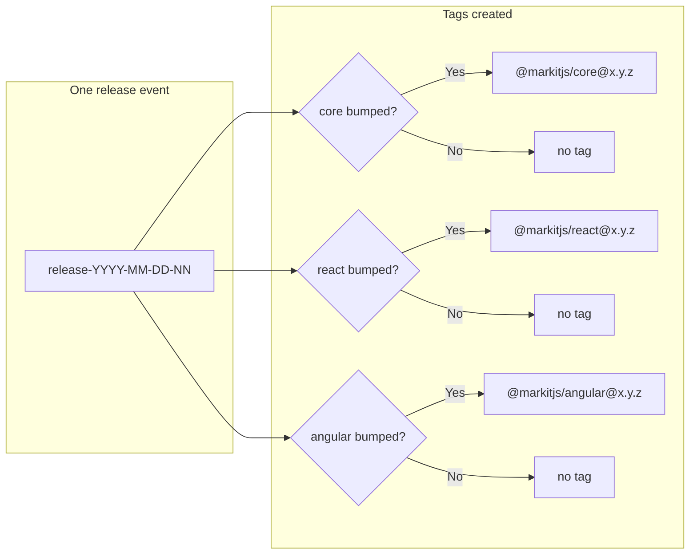

# Releasing

This guide covers the release process for MarkIt. It is intended for maintainers with npm publish access.

For contributing (no changesets required in PRs), see [CONTRIBUTING.md](CONTRIBUTING.md).

---

## How It Works

MarkIt uses [Changesets](https://github.com/changesets/changesets) for versioning and changelog generation. Releases are fully automated via three **manual** GitHub Actions runs — only repo **admins** can trigger them. Nothing runs automatically on push.

**Versioning:** Each package (`@markitjs/core`, `@markitjs/react`, `@markitjs/angular`) has **independent versions**. Only packages with changes (and their dependents, when core is bumped) get a version bump. Releases are keyed by a **release tag** (e.g. `release-2025-03-10-01`), not a single version number.

**Three steps:**

1. **Prepare release** — You run the **Prepare Release** workflow and choose the bump type **per package** (none / patch / minor / major). The workflow detects which packages have changes since the last release tag, generates a changeset only for those packages, runs `version-packages`, and opens a **pull request** with a suggested release tag (e.g. `release-2025-03-10-01`).
2. **Finalize release** — After the release PR is merged, you run **Finalize Release** with the release tag. It creates the single **release tag**, creates **package tags** only for packages whose version increased (`@markitjs/core@x.y.z`, etc.), generates release notes (since the previous release tag), and creates **one draft** GitHub Release with a “Package versions” section.
3. **Publish release** — When you're ready to ship, you run **Publish Release** with the release tag. It checks out that tag, runs tests and build, publishes to npm, creates package tarballs and a source zip, uploads them as **assets** to the single GitHub Release, and publishes the draft.

There is no “Version PR” — you never run `bun run changeset` in PRs. Prepare creates the changeset when you run it.

### Release flow (diagram)

One release event: Prepare (per-package bumps) → merge PR → Finalize (one release tag + package tags for bumped only) → Publish (npm + assets on the single GitHub Release).



**Release tag vs package tags:**

- **One release tag** per release: `release-YYYY-MM-DD-NN` (e.g. `release-2025-03-10-01`). This is the ref for the release and the single GitHub Release.
- **Package tags** (`@markitjs/core@1.0.1`, etc.) are created **only for packages whose version increased** in that release. Unchanged packages get no new tag.



---

## Prerequisites (one-time setup)

- **GitHub:** Only users with **admin** role on the repo can run Prepare, Finalize, Publish, and Rollback workflows.
- **npm:** An npm account, the `@markitjs` scope, and a Granular Access Token (write, bypass 2FA). Store it in a GitHub Environment secret (see [npm Setup](#npm-setup) below).
- **GitHub Environment:** Create an environment named `npm-publish` with the `NPM_TOKEN` secret. The Publish and Rollback workflows use it.
- **Repository secret DRAFT_RELEASE_PAT:** A GitHub Personal Access Token with **read and write** access to repository releases. The Publish Release (and Test Publish Release) workflows use it to list and publish draft releases; GitHub's default token does not return drafts. Add it under **Settings → Secrets and variables → Actions** (repository secrets, not environment).

---

## Versioning Strategy

Packages use **independent versioning** — each has its own version. The `.changeset/config.json` has no `fixed` group; `updateInternalDependencies: "patch"` means when `@markitjs/core` is bumped, dependents (`@markitjs/react`, `@markitjs/angular`) get a patch bump automatically. The repo’s config also sets `ignore: ["@markitjs/docs", "@markitjs/e2e-bench"]` so those apps are not versioned by Changesets.

### Semantic Versioning

| Bump  | When                              | Example         |
| ----- | --------------------------------- | --------------- |
| Patch | Bug fix, no API changes           | `1.0.0 → 1.0.1` |
| Minor | New feature, backwards-compatible | `1.0.0 → 1.1.0` |
| Major | Breaking change                   | `1.0.0 → 2.0.0` |

You choose the bump **per package** when you run **Prepare Release** (none / patch / minor / major). Only packages that have file changes since the last release tag are eligible; you can set “none” to skip a package.

### Release tag format

Releases are identified by a **release tag**: `release-YYYY-MM-DD-NN` (e.g. `release-2025-03-10-01`). There is **one** such tag per release event. Package tags (`@markitjs/core@1.0.1`, etc.) are created **only for packages whose version increased** in that release.

---

## Stable Release (step by step)

### 1. Merge PRs to main

Develop as usual. Open PRs, get them merged to `main`. **You do not add changesets** — no `bun run changeset` in PRs. CI still runs (build, test, typecheck, etc.).

### 2. Prepare the release

When you're ready to cut a release:

1. Go to **GitHub → Actions**.
2. Select the **Prepare Release** workflow.
3. Click **Run workflow**.
4. Set **core_bump**, **react_bump**, **angular_bump** to `none`, `patch`, `minor`, or `major` (only packages with changes will be bumped; “none” skips that package).
5. Run the workflow.

The workflow will:

- Find the latest **release tag** (e.g. `release-2025-03-10-01`) to determine “since when” to look for changes. If none exists, it uses a baseline.
- Detect which of `packages/core`, `packages/react`, `packages/angular` have changes since that ref.
- Generate a changeset that lists **only** the changed packages you chose to bump (with your selected bump type).
- Run `bun run version-packages` (only those packages and their dependents get new versions).
- Open a pull request to `main` with branch name `release/<suggested-release-tag>` (e.g. `release/release-2025-03-10-01`). The PR body includes the new package versions and says: “After merging, run **Finalize Release** with release tag `release-2025-03-10-01`.”

If no packages have changes or all bumps are “none”, the workflow exits without opening a PR.

### 3. Merge the release PR

After the PR passes all checks (CodeQL, build, test, etc.), merge it to `main`.

### 4. Finalize the release

1. Go to **GitHub → Actions**.
2. Select the **Finalize Release** workflow.
3. Click **Run workflow**.
4. Enter **release_tag** (e.g. `release-2025-03-10-01` — use the tag suggested in the PR).
5. Run the workflow.

The workflow will:

- Validate the release tag format and that it doesn’t already exist.
- Create and push the **release tag** (e.g. `release-2025-03-10-01`).
- Compare current package versions on `main` to the versions at the **previous** release tag; only packages whose version **increased** get a package tag (`@markitjs/core@x.y.z`, etc.).
- Create and push those **package tags** only.
- Generate release notes for the range **previous release tag → current ref**.
- Build the release body: “Package versions” (list of the three packages and their versions) plus the generated notes.
- Create **one draft** GitHub Release for the release tag with that body.

### 5. Publish the release

When you're happy with the draft and want to ship:

1. Go to **GitHub → Actions**.
2. Select the **Publish Release** workflow.
3. Click **Run workflow**.
4. Enter **release_tag** (e.g. `release-2025-03-10-01`).
5. Run the workflow.

The workflow will:

- Check out the repo at the **release tag**.
- Run typecheck, build, test, and CJS/ESM checks.
- Publish to npm (`bun run publish-packages` — only packages with new versions are published).
- Run `npm pack` for each of the three packages and create a **source zip** (`git archive`).
- Upload these **four assets** (3 tarballs + 1 zip) to the **single** GitHub Release for that tag.
- Publish the draft Release (it becomes visible on the Releases page).

### 6. Verify

- Check [npm](https://www.npmjs.com/package/@markitjs/core) for the new package versions.
- Check the [Releases page](https://github.com/saurabhiam/markit/releases) for the one release (e.g. “Release release-2025-03-10-01”) and its assets.

---

## When to use Rollback

Use the **Rollback** workflow when you need to undo a release (e.g. bad publish, wrong version).

1. Go to **GitHub → Actions** → **Rollback**.
2. Click **Run workflow**.
3. Enter **release_tag** (e.g. `release-2025-03-10-01`) to roll back.
4. Set **confirm_rollback** to `true` or to the release tag.
5. Run the workflow.

The workflow will:

- Resolve the **package versions** that were part of that release (from the tag’s `packages/*/package.json`).
- Delete the **single** GitHub Release for that release tag.
- Delete the **release tag** and all **package tags** that were created for that release.
- Unpublish (or deprecate) those **specific package versions** on npm.
- Open a PR that **reverts** the merge commit of the release PR (using `git revert -m 1` so the merge is reverted to main’s pre-merge state; so `main` goes back to the pre-release versions).

Only repo admins can run Rollback.

---

## Prerelease (Alpha / Beta / RC)

Prereleases allow publishing unstable versions without affecting the `latest` npm tag. The **Prerelease** workflow (if enabled) runs on push to `next`.

### Enter prerelease mode

```bash
git checkout -b next main
bun run changeset -- pre enter beta   # or alpha, rc
git add .changeset/pre.json
git commit -m "chore: enter beta prerelease mode"
git push -u origin next
```

### Develop on next

Create PRs targeting `next`. When they merge, the prerelease workflow handles versioning and publishing. Versions look like `1.0.0-beta.0`, `1.0.0-beta.1`, etc.

### Exit prerelease mode

```bash
bun run changeset -- pre exit
git add .changeset/pre.json
git commit -m "chore: exit prerelease mode"
```

Merge `next` back to `main` via a PR when you're ready for the next stable release.

---

## npm Setup

### Prerequisites

- An npm account at [npmjs.com](https://www.npmjs.com)
- The `markitjs` npm organization (owns the `@markitjs` scope)
- Two-factor authentication enabled on your npm account

### Token creation

npm supports **Granular Access Tokens** with a maximum expiration of 90 days for write tokens.

1. Go to [npmjs.com](https://www.npmjs.com) → avatar → **Access Tokens**
2. **Generate New Token** (Granular Access Token)
3. Configure: name, **Packages and scopes** → Read and write for `@markitjs`, **Bypass two-factor authentication** checked (required for CI), expiration 90 days.
4. Copy the token — it is shown only once.

### GitHub Environment

1. Repo → **Settings** → **Environments** → **New environment** → name: `npm-publish`
2. Add protection rules if desired (e.g. required reviewers, deployment branches: `main`, `next`).
3. **Environment secrets** → **Add secret** → Name: `NPM_TOKEN`, Value: the npm token.

The **Publish Release** and **Rollback** workflows use the `npm-publish` environment so they have access to `NPM_TOKEN`.

### Token rotation (every ~80 days)

Set a calendar reminder. Before the token expires:

1. Generate a new token on npm (same settings).
2. Update `NPM_TOKEN` in the GitHub `npm-publish` environment.
3. Delete the old token on npm.

If the token expires, the Publish workflow will fail at the npm step; fix the secret and re-run.

---

## Troubleshooting

### Prepare: “No packages to release”

The workflow found no changes under any package since the last release tag, or every package’s bump was set to “none”. Merge more PRs and run Prepare again, or adjust the bump choices.

### Finalize: “Tag already exists”

The release tag you entered was already created (e.g. a previous Finalize run). Use a new tag (e.g. increment the sequence: `release-2025-03-10-02`) or, if you already finalized and only need to publish, run **Publish Release** instead.

### Publish: “No release found for tag” / “No draft release found”

You entered a release tag that was never finalized, or the workflow cannot see the draft. Run **Finalize Release** first (after merging the release PR), then run **Publish Release** with the same release tag. Ensure **DRAFT_RELEASE_PAT** is set (GitHub’s default token does not list draft releases; the workflow finds the release by filtering the list for that tag and `draft: true`).

### Publish failed (tests, build, npm)

1. Check the [Actions](https://github.com/saurabhiam/markit/actions) run for the failing step.
2. Common causes: npm token expired (rotate and update `NPM_TOKEN`), build/test failure (fix on `main` and re-run Publish).
3. Re-run the **Publish Release** workflow after fixing.

### Accidentally published a bad release

Use **Rollback** with the **release tag** (e.g. `release-2025-03-10-01`). It will unpublish (if within 72 hours) or deprecate the package versions that were part of that release, delete the single GitHub Release and its tags, and open a revert PR.

---

## First release (one-time)

Before the first publish:

- [ ] npm org `@markitjs` exists, token created, `NPM_TOKEN` in GitHub Environment `npm-publish`
- [ ] `DRAFT_RELEASE_PAT` added in repo Secrets (read+write releases)
- [ ] `.changeset/config.json` has no `fixed` group, has `updateInternalDependencies: "patch"`, and has `ignore: ["@markitjs/docs", "@markitjs/e2e-bench"]` (see the file in the repo)

To do the first release:

1. Merge at least one PR to `main` (or have commits since the repo start).
2. Run **Prepare Release** with the desired bump types (e.g. core: minor, react: patch, angular: patch). Merge the release PR.
3. Run **Finalize Release** with the suggested release tag (e.g. `release-2025-03-10-01`).
4. Run **Publish Release** with the same release tag.
5. Verify on npm and the Releases page.

---

## Workflow reference

| Workflow             | File                                         | Trigger             | Purpose                                                                                                    |
| -------------------- | -------------------------------------------- | ------------------- | ---------------------------------------------------------------------------------------------------------- |
| Prepare Release      | `.github/workflows/prepare-release.yml`      | Manual (admin only) | Per-package bump → changeset, version, PR with suggested release tag                                       |
| Finalize Release     | `.github/workflows/finalize-release.yml`     | Manual (admin only) | release_tag → one release tag, package tags (bumped only), one draft                                       |
| Publish Release      | `.github/workflows/publish-release.yml`      | Manual (admin only) | release_tag → test, build, npm publish, 4 assets, publish one release                                      |
| Rollback             | `.github/workflows/rollback.yml`             | Manual (admin only) | release_tag → delete release/tags, unpublish those versions, revert PR                                     |
| Test Publish Release | `.github/workflows/test-publish-release.yml` | Manual              | release_tag → verify tag exists, package versions at tag, package tags, single GitHub Release (no publish) |
| CI                   | `.github/workflows/ci.yml`                   | Push/PR to `main`   | Build, test, typecheck, format                                                                             |
| Prerelease           | `.github/workflows/prerelease.yml`           | Push to `next`      | Prerelease version + publish                                                                               |
| Docs                 | `.github/workflows/docs.yml`                 | Push to `main`      | Build and deploy documentation                                                                             |
| Bundle Size          | `.github/workflows/bundle-size.yml`          | PR to `main`        | Measure bundle sizes                                                                                       |
| Dependency Review    | `.github/workflows/dependency-review.yml`    | PR to `main`        | Block vulnerable dependencies                                                                              |

**Workflow inputs:** Prepare takes per-package bump choices (none / patch / minor / major). Finalize, Publish, Rollback, and Test Publish Release all take a **release tag** (e.g. `release-2025-03-10-01`) as input — the same tag produced by Prepare’s PR and used for the single GitHub Release and its assets.
