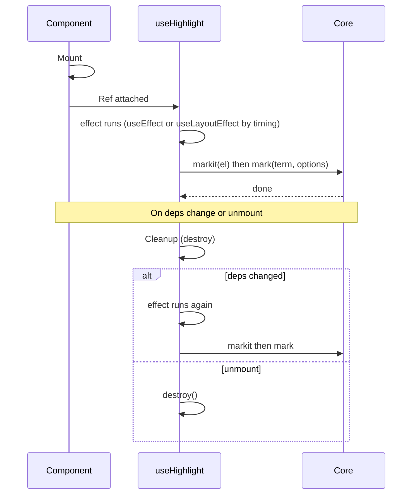
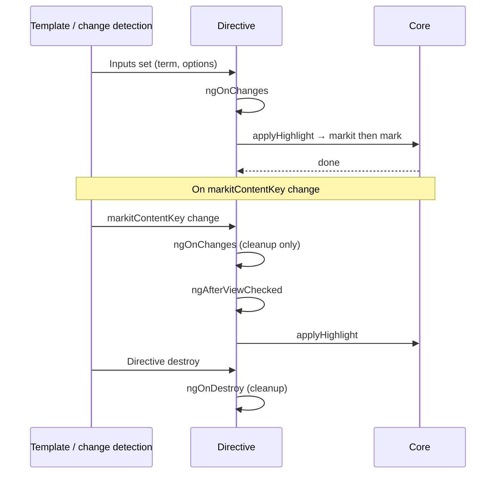

# Framework Lifecycles

This page explains how the React and Angular bindings integrate with the core highlighting engine over time: when highlights run, when they clean up, and when they re-apply after content or options change.

## React highlight cycle

`useHighlight` (and `<Highlighter>`) run the highlight in one effect that is either `useEffect` or `useLayoutEffect` depending on the `timing` option: with `timing: 'layout'` it runs in `useLayoutEffect` (before paint); otherwise it runs in `useEffect` (after paint). Both hooks are always called; only one runs the highlight logic.

**Dependencies:**

- **Stabilized term** — When `term` is an array, the effect re-runs only when the array's **contents** change, not when a new array reference with the same contents is passed.
- **optsMemo** — Shallow-compared options (including `contentKey` serialized as `contentKeyDep`).

**Flow:**

1. **Mount** — Component mounts, ref is attached to the container element.
2. **Effect runs** — With default `timing: 'effect'`, the effect runs after paint (in `useEffect`): any previous instance is destroyed, then `markit(el)` creates a new instance and `mark(term, options)` is called. With `timing: 'layout'`, the same logic runs before paint in `useLayoutEffect`.
3. **Dependency change** — If term (by value), options, or `contentKey` changes, the effect cleanup runs (`destroy()`), then the effect runs again and re-applies highlight. For dynamic content, pass `contentKey` so the effect re-runs when the content identity changes and avoids garbled text.
4. **Unmount** — Cleanup runs and `destroy()` is called.

**Timing:** Use `timing: 'effect'` (default) for CSS Highlight API; use `timing: 'layout'` with the DOM renderer to run before paint and avoid a flash of unhighlighted content.

### React lifecycle swimlane

---

## Angular highlight cycle

`MarkitHighlightDirective` runs all highlighting **outside NgZone** via `NgZone.runOutsideAngular()`. It reacts to input changes in `ngOnChanges` and, when `markitContentKey` is used, defers re-apply until after the view has updated in `ngAfterViewChecked`.

**Flow:**

1. **Inputs set** — Template binds `[markitHighlight]`, `[markitOptions]`, and optionally `[markitContentKey]`. Change detection updates the directive inputs.
2. **ngOnChanges** — If only `searchTerm` or `markitOptions` changed: run `applyHighlight()` outside NgZone (cleanup previous instance, create new one, call `mark()`). If `markitContentKey` changed: run cleanup only, set a flag, and wait for `ngAfterViewChecked`.
3. **ngAfterViewChecked** — If the content-key-changed flag is set and there is a term, run `applyHighlight()` outside NgZone (view has updated, so DOM is current). Clear the flag. If `markitContentKey` is set but the flag was not used, and the element’s text content changed since last apply, run `applyHighlight()` to catch dynamic content updates.
4. **ngOnDestroy** — Cleanup runs and the instance is destroyed.

Callbacks (`done`, `noMatch`) are wrapped so they **re-enter NgZone**, so updating component state from them triggers change detection correctly.

### Angular lifecycle swimlane

---

## Summary

| Framework   | When highlight runs                                                                               | When it cleans up                                     | Dynamic content                                                                         |
| ----------- | ------------------------------------------------------------------------------------------------- | ----------------------------------------------------- | --------------------------------------------------------------------------------------- |
| **React**   | After paint in `useEffect` (or before paint with `timing: 'layout'`)                              | Effect cleanup on deps change or unmount              | Pass `contentKey` so the effect re-runs when content identity changes                   |
| **Angular** | `ngOnChanges` (term/options) or `ngAfterViewChecked` (after content-key change or content update) | `ngOnChanges` (on contentKey change) or `ngOnDestroy` | Pass `[markitContentKey]` so the directive unmarks and re-applies after content updates |

Both bindings ensure only one MarkIt instance per container at a time and call `destroy()` before creating a new instance, so resources and (with the CSS Highlight API) registry state stay consistent.
